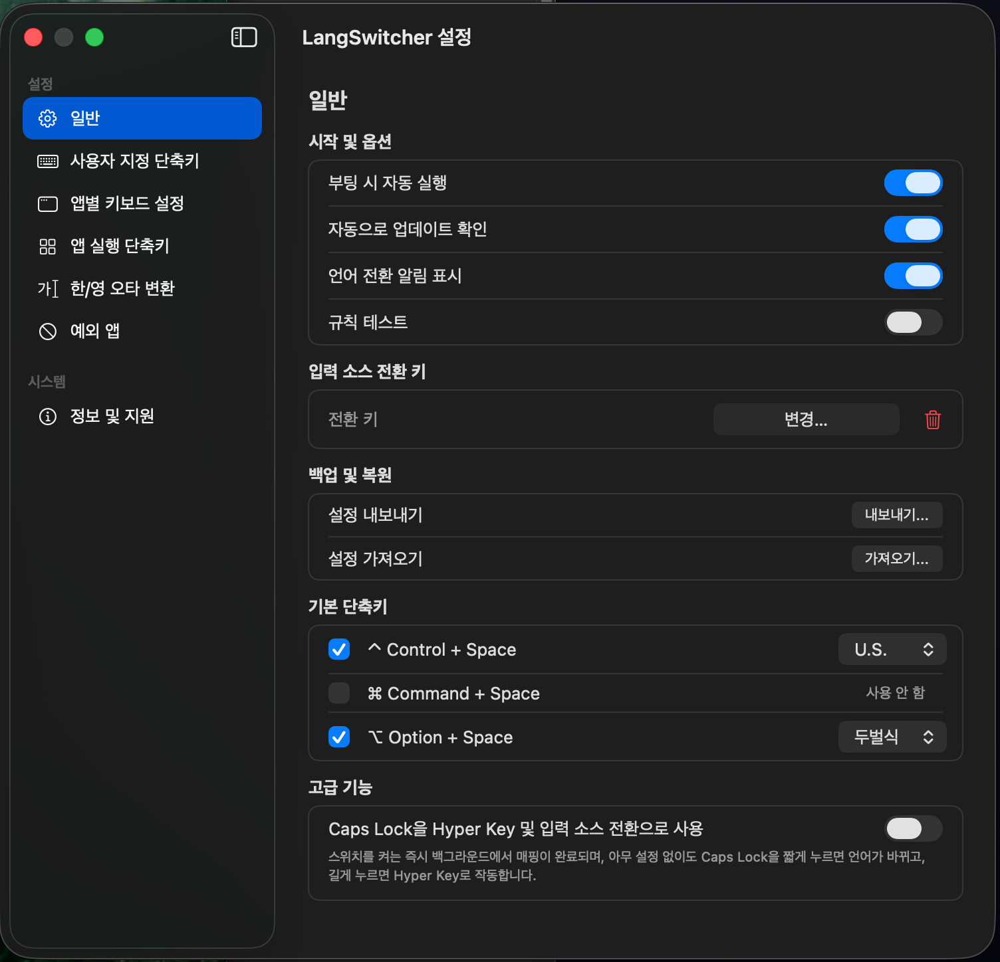

<p align="center">
  
</p>

# 🌐 LangSwitcher

A lightweight macOS menu bar app for faster and more predictable input source switching.

LangSwitcher helps reduce typing interruptions in shortcut-driven workflows such as Spotlight, ChatGPT, Terminal, browsers, and messengers.


## Why LangSwitcher

If you often launch apps or search tools with keyboard shortcuts, you have probably experienced input source mismatches right before typing.

LangSwitcher helps solve that by combining direct language switching, app-specific keyboard rules, app launch shortcuts, and typo correction in one native interface.

## ✨ Features (v0.5.0 Update)

- **Typo Correction (New in v0.5.0):** Instantly convert mistyped English text to Korean (or vice versa) with a single shortcut.
- **Hyper Key Mapping (New in v0.5.0):** Map your Caps Lock key to a system-wide Hyper Key (⌃⌥⇧⌘). UI stuttering issues have been completely resolved in this release.
- **Smart Conflict Detection (New in v0.5.0):** Safely protect your settings with red warnings and system beeps when duplicate shortcuts are registered.
- **Overwhelming Stability (New in v0.5.0):** Fundamentally blocks data conflicts and crashes in multi-threading environments by applying Swift 6 Concurrency and snapshot patterns.
- **Optimized Performance (New in v0.5.0):** Uses batch updates for settings restoration and optimizes log management performance to O(1).
- **Input Source Toggle Key:** Assign a single modifier key, such as Right Command or Right Option, as an input source toggle key.
- **Custom Shortcuts:** Bind your own shortcut combinations to switch directly to a specific input source.
- **App-Specific Keyboards:** Automatically switch to a predefined input source when a specific app becomes active.
- **App Launch Shortcuts:** Launch an app or bring it to the front instantly with a global shortcut.
- **Native HUD Feedback:** See language changes and rule test results with a native macOS-style HUD.
- **Backup & Restore:** Export your settings to JSON and restore them anytime.

## 🖼 Screenshots

<p align="center">
  
</p>

## 💻 System Requirements

- **OS:** macOS 13.5 or later
- **Architecture:** Apple Silicon (M1, M2, M3, M4) Macs only

## 📥 Installation

⚠️ **Note:** Because this is a free open-source project and not signed with a paid Apple Developer account, macOS may show an "unidentified developer" warning on first launch.

1. Go to the [Releases](https://github.com/peepworks/LangSwitcher/releases) page.
2. Download the latest `LangSwitcher_v0.5.0.zip` file and extract it.
3. Move `LangSwitcher.app` to your `Applications` folder.
4. Right-click `LangSwitcher.app` and choose **Open**.
5. If macOS says the app is damaged, run the following command in Terminal:

```bash
sudo xattr -r -d com.apple.quarantine /Applications/LangSwitcher.app
```

## ⚙️ Accessibility Permission

LangSwitcher requires **Accessibility** permission to detect keyboard shortcuts and simulate text corrections.

1. Open **System Settings** > **Privacy & Security** > **Accessibility**.
2. Click the `+` button and add `LangSwitcher.app`.
3. Turn the toggle **ON**.

🔄 **Update Note:** If shortcuts stop working after replacing the old app, remove LangSwitcher from Accessibility settings and add it again.

## 🚀 Quick Start

1. Open LangSwitcher from the menu bar and select **Preferences**.
2. In **General**, configure startup, HUD, Hyper Key, and your toggle key.
3. In **Custom Shortcuts**, bind specific languages to your favorite keys.
4. In **App-Specific Keyboards**, tell LangSwitcher which language each app prefers.
5. In **App Launch Shortcuts**, set up your global app triggers.

## ☕️ Donations

If you find this app helpful, consider supporting the project. Your support helps maintain the project.

| Cryptocurrency | Wallet Address |
| :--- | :--- |
| **Bitcoin (BTC)** | `14eZvFmfSnste92o66DcFq9ns7JqWepu1s` |
| **Dogecoin (DOGE)** | `D9sGuU6wXVCSnAPTESQsy1QcsxmTHt6VDW` |

## 🤝 Contributing

Contributions, bug reports, feature requests, and translation help are welcome.

## ⚖️ License

This project is licensed under the **GNU General Public License v3.0 (GPL-3.0)**.
See the [LICENSE](LICENSE) file for details.

<br>

---

<details>
<summary><strong>🇰🇷 한국어 버전 보기 (Click to view Korean version)</strong></summary>

# 🌐 LangSwitcher

LangSwitcher는 macOS에서 입력 언어 전환을 더 빠르고 정확하게 만들어 주는 가벼운 메뉴바 앱입니다.

단축키 중심의 워크플로우(Spotlight, ChatGPT, 터미널 등)에서 발생하는 입력 소스 오류를 해결하는 데 최적화되어 있습니다.

## LangSwitcher가 필요한 이유

단축키로 창을 열고 타이핑을 시작할 때, 한/영 상태가 반대로 되어 있어 지우고 다시 입력한 경험이 있으신가요?

LangSwitcher는 직접 언어 전환, 앱별 자동 규칙, 앱 실행 단축키, 오타 자동 변환 기능을 통해 이런 흐름의 끊김을 완벽하게 방지합니다.

## ✨ 주요 기능 (v0.5.0 업데이트)

- **오타 자동 변환 (Typo Correction):** 잘못 입력된 영문을 한글로(또는 반대로) 단축키 하나로 즉시 바꿉니다.
- **Hyper Key 변환:** Caps Lock 키를 시스템 전역 Hyper Key(⌃⌥⇧⌘)로 맵핑합니다. v0.5.0에서 UI 버벅임 문제를 완전히 해결했습니다.
- **스마트 충돌 감지 (v0.5.0 신규):** 중복된 단축키 등록 시 붉은색 경고와 시스템 비프로 알려주어 설정을 안전하게 보호합니다.
- **압도적인 안정성 (v0.5.0 신규):** Swift 6 Concurrency와 스냅샷 패턴을 적용하여, 멀티스레딩 환경에서의 데이터 충돌과 크래시(Crash)를 근본적으로 차단했습니다.
- **최적화된 성능 (v0.5.0 신규):** 설정 복원 시 배치 업데이트를 사용하고 로그 관리 성능을 O(1)로 최적화했습니다.
- **입력 소스 전환 키:** 우측 Command, 우측 Option 등을 단일 언어 전환 키로 지정할 수 있습니다.
- **사용자 지정 단축키:** 특정 입력소스로 즉시 전환하는 전역 단축키를 등록합니다.
- **앱별 키보드 설정:** 앱이 활성화될 때 선호하는 입력소스로 자동 전환합니다.
- **앱 실행 단축키:** 전역 단축키로 특정 앱을 즉시 실행하거나 포커스합니다.
- **네이티브 HUD 알림:** 언어 전환 상태를 macOS 스타일의 네이티브 HUD로 확인하세요.
- **설정 백업 및 복원:** 모든 설정을 JSON으로 내보내고 안전하게 복구할 수 있습니다.

## 🖼 스크린샷

<p align="center">
  
</p>

## 💻 시스템 요구사항

- **운영체제:** macOS 13.5 이상
- **지원 기기:** Apple Silicon (M1, M2, M3, M4) Mac 전용

## 📥 설치 방법

⚠️ **참고:** 이 앱은 유료 Apple Developer 계정으로 서명되지 않은 무료 오픈소스 프로젝트이므로, 최초 실행 시 macOS에서 "확인되지 않은 개발자" 경고가 표시될 수 있습니다.

1. [Releases](https://github.com/peepworks/LangSwitcher/releases) 페이지로 이동합니다.
2. `LangSwitcher_v0.5.0.zip` 파일을 다운로드하고 압축을 풉니다.
3. `LangSwitcher.app`을 `응용 프로그램(Applications)` 폴더로 이동합니다.
4. 앱을 우클릭한 뒤 **열기**를 선택합니다.
5. 앱 손상 오류가 발생하면 터미널에서 다음 명령어를 실행하세요:

```bash
sudo xattr -r -d com.apple.quarantine /Applications/LangSwitcher.app
```

## ⚙️ 손쉬운 사용 권한

단축키 감지 및 오타 변환 기능을 위해 권한 허용이 반드시 필요합니다.

1. **시스템 설정** > **개인정보 보호 및 보안** > **손쉬운 사용**으로 이동합니다.
2. `+` 버튼을 눌러 `LangSwitcher.app`을 추가합니다.
3. LangSwitcher 스위치를 **켜짐** 상태로 바꿉니다.

🔄 **업데이트 시 주의사항:** 앱 교체 후 단축키가 작동하지 않으면, 손쉬운 사용 목록에서 LangSwitcher를 삭제했다가 다시 추가해 주세요.

## 🚀 빠른 시작

1. 메뉴바에서 LangSwitcher를 선택하고 **환경설정(Preferences)**을 엽니다.
2. **일반** 탭에서 자동 실행, HUD, Hyper Key 등을 설정합니다.
3. **사용자 지정 단축키**에서 특정 언어 전용 단축키를 등록합니다.
4. **앱별 키보드 설정**에서 각 앱이 열릴 때 어떤 언어로 시작할지 정합니다.
5. **앱 실행 단축키**에서 자주 쓰는 앱들을 등록하세요.

## ☕️ 후원

이 앱이 도움이 되셨다면 커피 한 잔 후원을 고려해 주세요. 프로젝트 유지에 큰 힘이 됩니다.

| 암호화폐 | 지갑 주소 |
| :--- | :--- |
| **비트코인 (BTC)** | `14eZvFmfSnste92o66DcFq9ns7JqWepu1s` |
| **도지코인 (DOGE)** | `D9sGuU6wXVCSnAPTESQsy1QcsxmTHt6VDW` |

## 🤝 기여

버그 제보, 기능 제안, 번역 기여, 풀 리퀘스트를 환영합니다.

## ⚖️ 라이선스

이 프로젝트는 **GNU General Public License v3.0 (GPL-3.0)** 라이선스를 따릅니다.
자세한 내용은 [LICENSE](LICENSE) 파일을 참고해 주세요.

</details>
