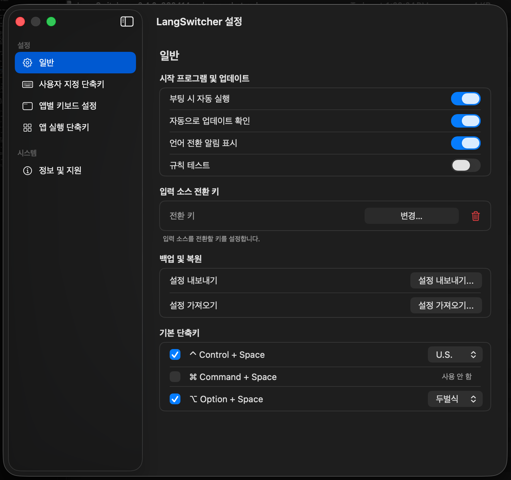

<p align="center">
  
</p>

# 🌐 LangSwitcher

A lightweight macOS menu bar app for faster and more predictable input source switching.

LangSwitcher helps reduce typing interruptions in shortcut-driven workflows such as Spotlight, ChatGPT, Terminal, browsers, and messengers.


## Why LangSwitcher

If you often launch apps or search tools with keyboard shortcuts, you have probably experienced input source mismatches right before typing.

LangSwitcher helps solve that by combining direct language switching, app-specific keyboard rules, app launch shortcuts, and an input source toggle key in one native interface.

## ✨ Features

- **Input Source Toggle Key (New in v0.4.0):** Assign a single modifier key, such as Right Command or Right Option, as an input source toggle key.
- **Custom Shortcuts:** Bind your own shortcut combinations to switch directly to a specific input source.
- **App-Specific Keyboards:** Automatically switch to a predefined input source when a specific app becomes active.
- **App Launch Shortcuts (New in v0.4.0):** Launch an app or bring it to the front instantly with a global shortcut.
- **Native HUD Feedback (New in v0.4.0):** See language changes and rule test results with a native macOS-style HUD.
- **Rules Test Mode:** Verify rules safely without triggering actual app launches or input source changes.
- **Backup & Restore:** Export your settings to JSON and restore them anytime.
- **Execution Logs:** Review recent execution history and export logs for troubleshooting.
- **Smart Conflict Detection:** Detect duplicate or conflicting shortcuts before saving them.
- **Modern Native UI:** A clean settings window designed with macOS-style sidebar navigation.

## 🖼 Screenshots

<p align="center">
  
</p>

### Settings

Add the latest General tab screenshot here.

This section can highlight the updated terminology, input source toggle key setup, backup and restore actions, and default shortcut layout.

## 💻 System Requirements

- **OS:** macOS 13.5 or later
- **Architecture:** Apple Silicon Macs only

## 📥 Installation

⚠️ **Note:** Because this is a free open-source project and not signed with a paid Apple Developer account, macOS may show an "unidentified developer" warning on first launch.

1. Go to the [Releases](https://github.com/peepworks/LangSwitcher/releases) page.
2. Download the latest release and extract the zip file.
3. Move `LangSwitcher.app` to your `Applications` folder.
4. Right-click `LangSwitcher.app` and choose **Open**.
5. If macOS says the app is damaged, run the following command in Terminal:

```bash
sudo xattr -r -d com.apple.quarantine /Applications/LangSwitcher.app
```

## ⚙️ Accessibility Permission

LangSwitcher requires **Accessibility** permission to detect global keyboard shortcuts.

1. Open **System Settings** > **Privacy & Security** > **Accessibility**.
2. Click the `+` button and add `LangSwitcher.app`.
3. Turn the toggle **ON**.

🔄 **When updating:** If shortcuts stop working after replacing the old app, remove LangSwitcher from Accessibility settings and add it again.

## 🚀 Quick Start

1. Open LangSwitcher from the menu bar and choose **Preferences**.
2. In **General**, configure startup behavior, HUD visibility, rules test mode, and your input source toggle key.
3. In **Custom Shortcuts**, assign shortcuts for direct language switching.
4. In **App-Specific Keyboards**, set default input sources for individual apps.
5. In **App Launch Shortcuts**, bind shortcuts to frequently used apps.

## 🧭 Settings Overview

### General

Manage startup options, update checks, HUD display, rules test mode, input source toggle key, backup and restore, and default shortcuts.

### Custom Shortcuts

Create global shortcuts for switching directly to a selected input source.

### App-Specific Keyboards

Assign a default input source to specific apps so language switching feels automatic and predictable.

### App Launch Shortcuts

Register shortcuts that launch an app or bring an existing app window to the front.

### Info & Support

Use this section for version info, support links, and exported execution logs.

## 🛠 Troubleshooting

- Make sure Accessibility permission is enabled.
- Review shortcut conflicts before assigning new combinations.
- Use Rules Test Mode before enabling a new workflow.
- Export execution logs when reporting an issue.

## ☕️ Donations

If you find this app helpful, consider buying me a coffee. Your support helps maintain the project.

| Cryptocurrency | Wallet Address |
| :--- | :--- |
| **Bitcoin (BTC)** | `14eZvFmfSnste92o66DcFq9ns7JqWepu1s` |
| **Dogecoin (DOGE)** | `D9sGuU6wXVCSnAPTESQsy1QcsxmTHt6VDW` |

## 🤝 Contributing

Contributions, bug reports, feature requests, and translation help are welcome.

## ⚖️ License

This project is licensed under the **GNU General Public License v3.0 (GPL-3.0)**.
See the [LICENSE](LICENSE) file for details.

<br>

---

<details>
<summary><strong>🇰🇷 한국어 버전 보기 (Click to view Korean version)</strong></summary>

# 🌐 LangSwitcher

LangSwitcher는 macOS에서 입력 언어 전환을 더 빠르고 자연스럽게 만들어 주는 가벼운 메뉴바 앱입니다.

Spotlight, ChatGPT, 터미널, 브라우저, 메신저처럼 단축키 중심으로 작업할 때 생기는 입력소스 꼬임을 줄이는 데 초점을 두고 있습니다.

## LangSwitcher가 하는 일

단축키로 앱을 열자마자 입력 언어가 예상과 다르게 잡혀 다시 지우고 입력해야 하는 상황이 자주 생깁니다.

LangSwitcher는 직접 언어 전환, 앱별 자동 전환, 앱 실행 단축키, 입력 소스 전환 키를 하나의 네이티브 인터페이스로 묶어 이런 불편을 줄여 줍니다.

## ✨ 주요 기능

- **입력 소스 전환 키 (v0.4.0 신규):** 우측 Command, 우측 Option 같은 단일 수식어 키를 입력 소스 전환 키로 지정할 수 있습니다.
- **사용자 지정 단축키:** 특정 입력소스로 바로 전환하는 단축키를 직접 설정할 수 있습니다.
- **앱별 키보드 설정:** 특정 앱이 활성화되면 미리 지정한 입력소스로 자동 전환할 수 있습니다.
- **앱 실행 단축키 (v0.4.0 신규):** 전역 단축키로 앱을 실행하거나 앞으로 가져올 수 있습니다.
- **HUD 알림 (v0.4.0 신규):** 언어 전환과 규칙 테스트 결과를 macOS 스타일의 HUD로 확인할 수 있습니다.
- **규칙 테스트 모드:** 실제 동작 없이 규칙만 안전하게 점검할 수 있습니다.
- **설정 백업 및 복원:** 설정을 JSON 파일로 저장하고 다시 불러올 수 있습니다.
- **실행 로그:** 최근 동작 기록을 확인하고 문제 해결에 활용할 수 있습니다.
- **스마트 충돌 감지:** 중복되거나 충돌하는 단축키를 저장 전에 확인할 수 있습니다.
- **모던 네이티브 UI:** macOS 스타일의 사이드바 기반 설정 화면을 제공합니다.

## 🖼 스크린샷

### 설정 화면

<p align="center">
  
</p>

## 💻 시스템 요구사항

- **운영체제:** macOS 13.5 이상
- **지원 기기:** Apple Silicon Mac 전용

## 📥 설치 방법

⚠️ **참고:** 이 앱은 유료 Apple Developer 계정으로 서명되지 않은 무료 오픈소스 프로젝트이므로, 최초 실행 시 macOS에서 "확인되지 않은 개발자" 경고가 표시될 수 있습니다.

1. [Releases](https://github.com/peepworks/LangSwitcher/releases) 페이지에서 최신 버전을 다운로드합니다.
2. 압축을 풀고 `LangSwitcher.app`을 `Applications` 폴더로 이동합니다.
3. `LangSwitcher.app`을 우클릭한 뒤 **열기**를 선택합니다.
4. 만약 앱이 손상되었다고 표시되면, 아래 명령어를 터미널에서 실행합니다.

```bash
sudo xattr -r -d com.apple.quarantine /Applications/LangSwitcher.app
```

## ⚙️ 손쉬운 사용 권한

LangSwitcher는 전역 단축키를 감지하기 위해 **손쉬운 사용** 권한이 필요합니다.

1. **시스템 설정** > **개인정보 보호 및 보안** > **손쉬운 사용**으로 이동합니다.
2. `+` 버튼을 눌러 `LangSwitcher.app`을 추가합니다.
3. LangSwitcher 스위치를 **켜짐** 상태로 바꿉니다.

🔄 **업데이트 시:** 기존 앱을 새 버전으로 교체한 뒤 단축키가 동작하지 않으면, 손쉬운 사용 목록에서 LangSwitcher를 제거한 뒤 다시 추가해 주세요.

## 🚀 빠른 시작

1. 메뉴바에서 LangSwitcher를 열고 **설정**으로 들어갑니다.
2. **일반** 탭에서 자동 실행, HUD, 규칙 테스트, 입력 소스 전환 키를 설정합니다.
3. **사용자 지정 단축키**에서 특정 언어로 바로 전환하는 단축키를 등록합니다.
4. **앱별 키보드 설정**에서 앱마다 기본 입력소스를 지정합니다.
5. **앱 실행 단축키**에서 자주 쓰는 앱을 단축키와 연결합니다.

## 🧭 설정 메뉴 안내

### 일반

자동 실행, 업데이트 확인, HUD 표시, 규칙 테스트, 입력 소스 전환 키, 백업 및 복원, 기본 단축키를 관리합니다.

### 사용자 지정 단축키

원하는 입력소스로 바로 전환하는 전역 단축키를 추가합니다.

### 앱별 키보드 설정

특정 앱이 활성화되었을 때 자동으로 사용할 입력소스를 지정합니다.

### 앱 실행 단축키

앱 실행 또는 앱 앞으로 가져오기를 위한 단축키를 등록합니다.

### 정보 및 지원

버전 정보, 지원 링크, 실행 로그 내보내기 기능을 제공합니다.

## 🛠 문제 해결

- 손쉬운 사용 권한이 허용되어 있는지 확인해 주세요.
- 새 단축키를 지정하기 전에 기존 충돌 여부를 확인해 주세요.
- 규칙 테스트 모드로 먼저 동작을 점검해 보세요.
- 문제가 있으면 실행 로그를 함께 첨부해 주세요.

## ☕️ 후원

이 앱이 도움이 되셨다면 커피 한 잔 후원을 고려해 주세요. 프로젝트 유지보수에 큰 힘이 됩니다.

| 암호화폐 | 지갑 주소 |
| :--- | :--- |
| **비트코인 (BTC)** | `14eZvFmfSnste92o66DcFq9ns7JqWepu1s` |
| **도지코인 (DOGE)** | `D9sGuU6wXVCSnAPTESQsy1QcsxmTHt6VDW` |

## 🤝 기여

버그 제보, 기능 제안, 번역 기여, 풀 리퀘스트를 환영합니다.

## ⚖️ 라이선스

이 프로젝트는 **GNU General Public License v3.0 (GPL-3.0)** 라이선스를 따릅니다.
자세한 내용은 [LICENSE](LICENSE) 파일을 참고해 주세요.

</details>
