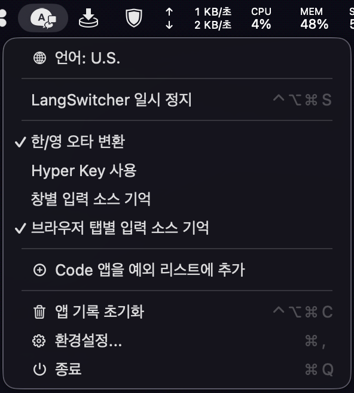
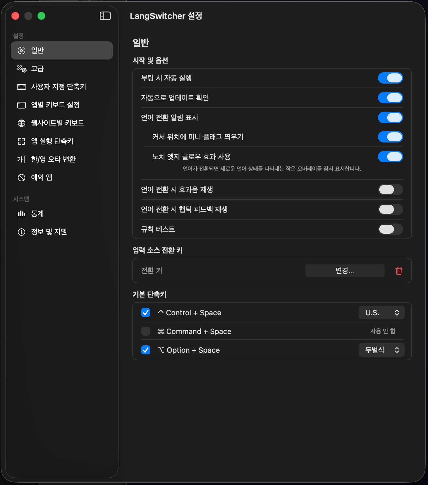

# <p align="center">🌐 LangSwitcher</p>

<p align="center">
  
</p>

<p align="center">
  <strong>A lightweight macOS menu bar app for faster and more predictable input source switching.</strong>
</p>

<p align="center">
  LangSwitcher helps reduce typing interruptions in shortcut-driven workflows such as Spotlight, ChatGPT, Terminal, browsers, and messengers.
</p>

---

# ✨ Why LangSwitcher?

If you frequently launch apps or search tools using keyboard shortcuts, you've probably experienced input source mismatches right before typing.

LangSwitcher solves this by combining:

- Direct language switching
- App-specific keyboard rules
- Browser tab language memory
- App launch shortcuts
- Typo correction

...all inside one native macOS menu bar app.

---

# 🚀 Features

## 🆕 v0.7.0 Highlights

### 🌐 Browser Tab Memory (Beta)
Supports:

- Chrome
- Safari
- Edge
- Brave

LangSwitcher remembers the input language for each browser tab independently.

Switch between tabs without losing your typing flow.

---

### ⚡ Adaptive Typo Correction Engine

Dynamically adjusts clipboard restoration timing depending on the active application.

Examples:

- Native macOS apps → ultra-fast restoration
- Electron apps (VSCode, Discord, etc.) → additional buffer timing for maximum reliability

Designed for stable typo correction without dropped characters.

---

### 🧠 Advanced Memory Management

- Automatically clears stored window language states when apps close
- Reduces unnecessary memory usage
- Includes a manual **Clear Memory** button inside Preferences

---

### 🏗 Performance & Architecture Overhaul

Major internal improvements:

- Reduced IPC overhead
- Flattened async barriers
- Deadlock-free state management
- Improved stability under heavy multitasking

---

## 🎨 Core Features

### 🌈 Dynamic Neon Edge Glow

Visual feedback using smart HSV-based random colors:

- Korean → cool blue/purple tones
- English → warm orange/pink tones

---

### 🔊 Polyphonic Audio Feedback

Mechanical typing sounds overlap naturally without abrupt cut-offs for a premium typing experience.

---

### 🔤 Typo Correction

Instantly convert:

- Mistyped English → Korean
- Mistyped Korean → English

...using a single shortcut.

---

### ⌨️ Hyper Key Mapping

Map Caps Lock to a system-wide Hyper Key:

```text
⌃⌥⇧⌘
```

---

### 🔁 Input Source Toggle Key

Assign a single modifier key such as:

- Right Command
- Right Option

...as an input source toggle key.

---

### ⚙️ Custom Shortcuts

Bind global shortcuts directly to specific input sources.

---

### 🧩 App-Specific Keyboards

Automatically switch to predefined input sources when specific apps become active.

---

### 🚀 App Launch Shortcuts

Launch or focus apps instantly using global keyboard shortcuts.

---

### 🪟 Native HUD Feedback

macOS-style HUD notifications for:

- Input source changes
- Rule test results

---

### 💾 Backup & Restore

Export all settings to JSON and restore them anytime.

---

# 🖼 Screenshots

<p align="center">
  
</p>

<p align="center">
  
</p>

---

# 💻 System Requirements

| Requirement | Details |
|---|---|
| OS | macOS 13.5 or later |
| Architecture | Apple Silicon only (M1 / M2 / M3 / M4) |

---

# 📥 Installation

> [!WARNING]
> Because this is a free open-source project and not signed with a paid Apple Developer account, macOS may show an **"unidentified developer"** warning on first launch.

## Install Steps

1. Go to the **Releases** page.
2. Download the latest `LangSwitcher_v0.7.0.zip`
3. Extract the ZIP file
4. Move `LangSwitcher.app` into your `/Applications` folder
5. Right-click the app and choose **Open**

---

## 🛠 If macOS says the app is damaged

Run the following command in Terminal:

```bash
sudo xattr -r -d com.apple.quarantine /Applications/LangSwitcher.app
```

---

# ⚙️ Permissions

LangSwitcher requires the following permissions for full functionality.

---

## 1️⃣ Accessibility Permission (Required)

Required for:

- Global shortcut detection
- Typo correction
- Input source control

### Enable Here

```text
System Settings
→ Privacy & Security
→ Accessibility
→ Enable LangSwitcher
```

---

## 2️⃣ Automation Permission (Optional)

Required for:

- Browser Tab Memory feature

### Enable Here

```text
System Settings
→ Privacy & Security
→ Automation
→ Enable supported browsers under LangSwitcher
```

Examples:

- Chrome
- Safari
- Edge
- Brave

---

# 🔄 Update Notes

If shortcuts stop working after updating the app:

1. Remove LangSwitcher from Accessibility settings
2. Re-add it again

```text
Accessibility
→ Remove (-)
→ Add (+)
```

---

# 🚀 Quick Start

1. Open LangSwitcher from the menu bar
2. Open **Preferences**
3. Configure:
   - Startup behavior
   - HUD
   - Hyper Key
   - Toggle key
4. Enable:
   - Window Focus Management
   - Browser Tab Memory
5. Add custom language shortcuts
6. Configure app-specific keyboards
7. Add app launch shortcuts

---

# ☕ Donations

If LangSwitcher helps improve your workflow, consider supporting the project.

Your support helps maintain and improve the app ❤️

| Cryptocurrency | Wallet Address |
|---|---|
| Bitcoin (BTC) | `14eZvFmfSnste92o66DcFq9ns7JqWepu1s` |
| Dogecoin (DOGE) | `D9sGuU6wXVCSnAPTESQsy1QcsxmTHt6VDW` |

---

# 🤝 Contributing

Contributions are always welcome.

You can help with:

- Bug reports
- Feature requests
- Pull requests
- Translations
- Documentation improvements

---

# ⚖️ License

This project is licensed under the **GNU General Public License v3.0 (GPL-3.0)**.

See the `LICENSE` file for details.

---

# 🇰🇷 한국어

<details>
<summary><strong>클릭해서 한국어 버전 보기</strong></summary>

<br>

# 🌐 LangSwitcher

<p align="center">
  
</p>

<p align="center">
  <strong>macOS에서 입력 언어 전환을 더 빠르고 정확하게 만들어 주는 경량 메뉴바 앱</strong>
</p>

<p align="center">
  Spotlight, ChatGPT, Terminal, 브라우저, 메신저 같은 단축키 중심 워크플로우에서 발생하는 입력 소스 전환 스트레스를 줄여 줍니다.
</p>

---

# ✨ LangSwitcher가 필요한 이유

앱을 단축키로 실행한 뒤 바로 타이핑을 시작할 때:

- 한/영 상태가 반대로 되어 있거나
- 입력 흐름이 끊기거나
- 다시 지우고 입력해야 하거나
- 브라우저 탭마다 입력 언어가 섞여 버리거나

...이런 경험이 있으셨나요?

LangSwitcher는 아래 기능들을 하나의 네이티브 macOS 인터페이스로 통합하여 이런 문제를 해결합니다.

- 직접 입력 언어 전환
- 앱별 자동 입력 언어 규칙
- 브라우저 탭별 언어 기억
- 앱 실행 단축키
- 오타 자동 변환

키보드 중심 워크플로우를 최대한 끊기지 않도록 설계되었습니다.

---

# 🚀 주요 기능

## 🆕 v0.7.0 업데이트

### 🌐 브라우저 탭별 언어 기억 (Beta)

지원 브라우저:

- Chrome
- Safari
- Edge
- Brave

각 브라우저 탭마다 입력 언어 상태를 개별적으로 기억하고 자동 복원합니다.

탭을 이동해도 이전 입력 상태가 유지되어 작업 흐름이 끊기지 않습니다.

---

### ⚡ 적응형 오타 교정 엔진

현재 활성화된 앱 특성에 따라 클립보드 복구 타이밍을 자동 조절합니다.

예시:

- 네이티브 macOS 앱 → 초고속 복구
- Electron 기반 앱(VSCode, Discord 등) → 안정성을 위한 추가 버퍼 적용

무거운 에디터 환경에서도 오타 교정이 씹히지 않도록 안정성을 강화했습니다.

---

### 🧠 고급 메모리 관리

- 앱 종료 시 저장된 창별 언어 상태 자동 정리
- 불필요한 메모리 사용 최소화
- 설정 창에서 수동 캐시 초기화 지원
- 장시간 사용 시에도 안정적인 상태 유지

---

### 🏗 성능 및 아키텍처 개선

내부 구조를 대대적으로 개선했습니다.

포함 내용:

- IPC 통신 오버헤드 감소
- 비동기 큐 구조 단순화
- 데드락(Deadlock) 방지
- 상태 관리 안정성 향상
- 멀티스레드 환경 최적화

고부하 환경에서도 더욱 안정적으로 동작합니다.

---

## 🎨 핵심 기능

### 🌈 다이내믹 네온 엣지 글로우

언어 전환 시 화면 가장자리에 HSV 기반 네온 효과를 표시합니다.

색상 예시:

- 한글 → 블루 / 퍼플 계열
- 영문 → 오렌지 / 핑크 계열

단순 상태 표시를 넘어 시각적으로 즉각적인 피드백을 제공합니다.

---

### 🔊 다중 사운드 피드백

기계식 키보드 스타일의 타건음이 자연스럽게 겹쳐 재생됩니다.

사운드가 끊기지 않고 이어져 더욱 몰입감 있는 타이핑 경험을 제공합니다.

---

### 🔤 오타 자동 변환 (Typo Correction)

잘못 입력된:

- 영문 → 한글
- 한글 → 영문

...을 단축키 하나로 즉시 변환합니다.

입력 흐름을 유지한 채 빠르게 수정할 수 있습니다.

---

### ⌨️ Hyper Key 변환

Caps Lock 키를 시스템 전역 Hyper Key로 변환할 수 있습니다.

```text
⌃⌥⇧⌘
```

복잡한 글로벌 단축키 구성에 매우 유용합니다.

---

### 🔁 입력 소스 전환 키

우측 Command, 우측 Option 같은 단일 수식어 키를 입력 언어 전환 키로 지정할 수 있습니다.

빠르고 직관적인 언어 전환 환경을 구성할 수 있습니다.

---

### ⚙️ 사용자 지정 단축키

특정 입력 언어로 즉시 전환하는 글로벌 단축키를 자유롭게 등록할 수 있습니다.

예시:

- 한글 전용 단축키
- 영어 전용 단축키

---

### 🧩 앱별 키보드 설정

특정 앱이 활성화될 때 원하는 입력 언어로 자동 전환합니다.

예시:

- Terminal → English
- KakaoTalk → Korean
- VSCode → English

앱마다 최적화된 입력 환경을 자동으로 유지할 수 있습니다.

---

### 🚀 앱 실행 단축키

글로벌 단축키로 앱을 즉시 실행하거나 앞으로 가져올 수 있습니다.

자주 사용하는 앱 실행 흐름을 더욱 빠르게 구성할 수 있습니다.

---

### 🪟 네이티브 HUD 알림

macOS 스타일 HUD를 통해 다음 정보를 표시합니다.

- 입력 언어 변경 상태
- 규칙 테스트 결과
- 전환 성공 여부

시스템과 자연스럽게 어우러지는 UI를 제공합니다.

---

### 💾 설정 백업 및 복원

모든 설정을 JSON 파일로 내보내고 언제든 복원할 수 있습니다.

새로운 Mac 환경에서도 쉽게 설정을 이전할 수 있습니다.

---

# 🖼 스크린샷

<p align="center">
  
</p>

<p align="center">
  
</p>

---

# 💻 시스템 요구사항

| 항목 | 내용 |
|---|---|
| 운영체제 | macOS 13.5 이상 |
| 지원 기기 | Apple Silicon 전용 (M1 / M2 / M3 / M4) |

---

# 📥 설치 방법

> [!WARNING]
> LangSwitcher는 무료 오픈소스 프로젝트이며 유료 Apple Developer 계정으로 서명되지 않았기 때문에 최초 실행 시 macOS 경고가 표시될 수 있습니다.

## 설치 순서

1. Releases 페이지로 이동합니다.
2. 최신 `LangSwitcher_v0.7.0.zip` 파일을 다운로드합니다.
3. 압축을 해제합니다.
4. `LangSwitcher.app`을 `/Applications` 폴더로 이동합니다.
5. 앱을 우클릭한 뒤 `열기(Open)`를 선택합니다.

---

## 🛠 앱 손상 오류 해결

macOS에서 앱이 손상되었다고 표시될 경우 아래 명령을 실행하세요.

```bash
sudo xattr -r -d com.apple.quarantine /Applications/LangSwitcher.app
```

---

# ⚙️ 권한 설정

LangSwitcher가 정상적으로 동작하려면 아래 권한이 필요합니다.

---

## 1️⃣ 손쉬운 사용 권한 (필수)

필요 기능:

- 글로벌 단축키 감지
- 오타 자동 변환
- 입력 소스 제어
- 키 이벤트 처리

설정 위치:

```text
시스템 설정
→ 개인정보 보호 및 보안
→ 손쉬운 사용
→ LangSwitcher 활성화
```

---

## 2️⃣ 자동화 권한 (선택)

브라우저 탭별 언어 기억 기능에 필요합니다.

설정 위치:

```text
시스템 설정
→ 개인정보 보호 및 보안
→ 자동화
→ LangSwitcher 하위 브라우저 활성화
```

지원 브라우저 예시:

- Chrome
- Safari
- Edge
- Brave

---

# 🔄 업데이트 시 주의사항

업데이트 후 단축키가 동작하지 않는 경우:

1. 손쉬운 사용 목록에서 LangSwitcher 제거
2. 다시 추가

```text
손쉬운 사용
→ 제거 (-)
→ 추가 (+)
```

권한 캐시 문제를 해결하는 데 도움이 됩니다.

---

# 🚀 빠른 시작

1. 메뉴바에서 LangSwitcher 실행
2. `환경설정(Preferences)` 열기
3. 다음 항목 설정:
   - 자동 실행
   - HUD 표시
   - Hyper Key
   - 입력 전환 키
4. 창별 언어 기억 / 브라우저 탭 기억 활성화
5. 사용자 지정 단축키 등록
6. 앱별 키보드 규칙 설정
7. 앱 실행 단축키 추가

몇 분만 설정하면 훨씬 자연스러운 입력 환경을 경험할 수 있습니다.

---

# ☕ 후원

LangSwitcher가 작업 흐름 개선에 도움이 되었다면 프로젝트 후원을 고려해 주세요 ❤️

후원은 프로젝트 유지 및 기능 개선에 큰 도움이 됩니다.

| 암호화폐 | 지갑 주소 |
|---|---|
| 비트코인 (BTC) | `14eZvFmfSnste92o66DcFq9ns7JqWepu1s` |
| 도지코인 (DOGE) | `D9sGuU6wXVCSnAPTESQsy1QcsxmTHt6VDW` |

---

# 🤝 기여

다음과 같은 기여를 언제든 환영합니다.

- 버그 제보
- 기능 제안
- Pull Request
- 번역
- 문서 개선
- UI/UX 개선 아이디어

작은 기여도 프로젝트에 큰 도움이 됩니다.

---

# ⚖️ 라이선스

이 프로젝트는 GNU General Public License v3.0 (GPL-3.0)을 따릅니다.

자세한 내용은 `LICENSE` 파일을 참고하세요.

</details>
