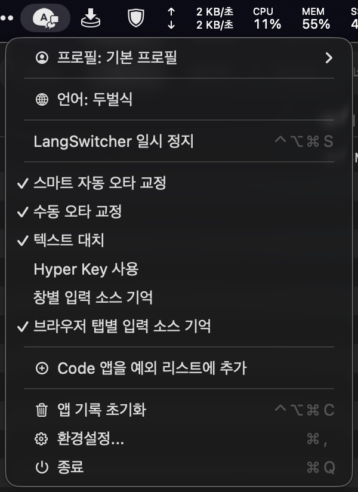
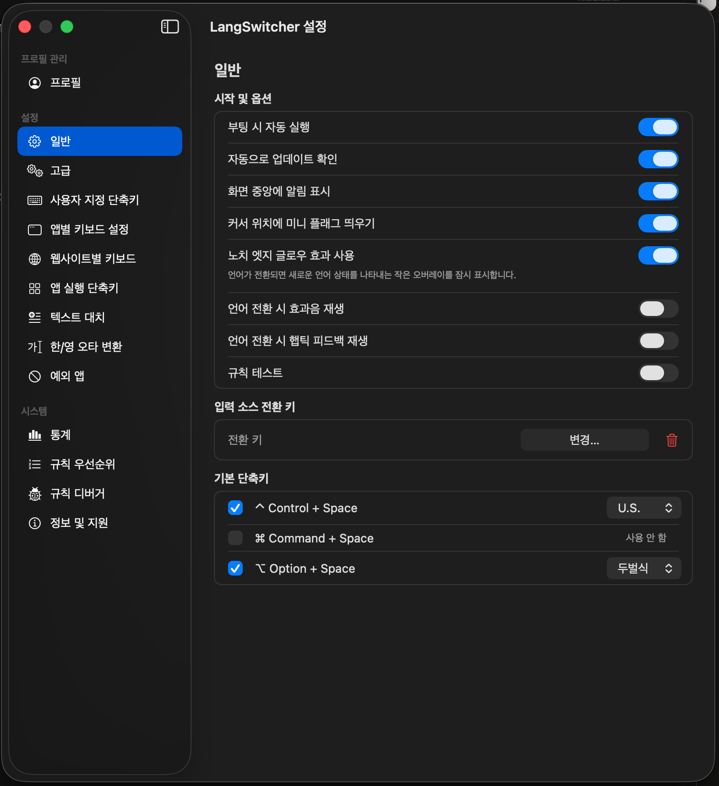

# <p align="center">🌐 LangSwitcher v0.9.0</p>

<p align="center">
  
</p>

<p align="center">
  <strong>A lightweight macOS menu bar app for faster, smarter, and more predictable input source switching.</strong>
</p>

<p align="center">
  macOS에서 입력 언어 전환을 더 빠르고 정확하게 만들어 주는 경량 메뉴바 앱입니다.
</p>

<p align="center">
  <a href="https://github.com/sponsors/peepworks">
    
  </a>
</p>

---

## English

### What's New in v0.9.0

#### 🗂️ Profile Support
v0.9.0 introduces profile support, making it easier to organize and switch between different LangSwitcher setups depending on your workflow or usage scenario.

#### 🔒 Enterprise-Grade Stability & System Hardening
LangSwitcher's internal architecture has been reinforced to better resist long-running resource leaks and background degradation. It now reclaims Unix file descriptors from helper processes such as `hidutil` and `plutil`, and keeps accessibility observers (`AXObserver`) anchored to macOS's native Main RunLoop for more stable long-term operation.

#### ⚡ Race-Free Task & Event Management
To reduce micro-stuttering during rapid app switching, `AppMonitor` now cancels stale background tasks more aggressively. This ensures only the currently relevant window and task chain continue consuming system resources.

#### 📈 Faster O(1) Activity Data Pipeline
The internal activity/statistics pipeline has been refactored from a row-shifting \(O(n)\) structure to an append-based \(O(1)\) model. Statistics and chart-related calculations now complete in a lighter single-pass flow, reducing the chance that logging or analytics affects typing responsiveness.

#### ♻️ Proactive Asset Memory Cleanup
High-resolution app icon image buffers (`NSImage`) are now released as soon as list rows leave the visible area or when preference tabs change. This helps keep active memory usage flatter during long sessions.

---

### What's New in v0.8.0 (Legacy)

- **Zero-Delay Typo Correction** — switches the input source first and removes artificial backspace timers to prevent broken characters and leftover English text.
- **Custom Text Expansion / Snippets** — expands user-defined triggers after pressing Space and supports dynamic placeholders such as `{{date:yyyy-MM-dd}}`, `{{date:HH:mm}}`, and `{{clipboard}}`.
- **Smart Shortcut Conflict Prevention** — blocks keys like `Cmd + Space` only when they are actively used as default language toggles.

Examples:
- `;date` → `{{date:yyyy-MM-dd}}`
- `;time` → `{{date:HH:mm}}`
- `;now` → `{{date:yyyy-MM-dd HH:mm}}`
- `;day` → `{{date:EEEE}}`
- `;clip` → `{{clipboard}}`

---

### Why LangSwitcher?

If you often launch apps or jump into search fields with keyboard shortcuts, you have probably experienced typing in the wrong language right after focusing a new app or browser tab. LangSwitcher is designed to reduce those interruptions and keep your keyboard workflow smooth.

It combines direct language switching, profile-based setup management, app-specific input rules, browser tab language memory, app launch shortcuts, typo correction, and text expansion in one native macOS menu bar app.

---

### Core Features

- Direct input source switching with custom shortcuts.
- Profile support for managing different LangSwitcher setups.
- App-specific keyboard rules that automatically switch language when an app becomes active.
- Browser Tab Memory for Chrome, Safari, Edge, and Brave.
- Typo correction for mistyped English ⇄ Korean text.
- Custom Text Expansion / Snippets with trigger-based replacement.
- Dynamic snippet variables for date, time, weekday, and clipboard content.
- Hyper Key mapping for Caps Lock (`⌃⌥⇧⌘`).
- Single modifier toggle key support, such as Right Command or Right Option.
- App Launch Shortcuts to launch or focus apps instantly.
- Native HUD feedback for input source changes and rule test results.
- Backup and restore settings with JSON export/import.

---

### Screenshots

<p align="center">
  
</p>

<p align="center">
  
</p>

---

### System Requirements

| Item | Requirement |
|---|---|
| OS | macOS 13.5 or later |
| Architecture | Apple Silicon only (M1 / M2 / M3 / M4) |

---

### Installation

> [!WARNING]
> LangSwitcher is a free open-source project and is not signed with a paid Apple Developer account, so macOS may show an **"unidentified developer"** warning on first launch.

1. Go to the **Releases** page.
2. Download the latest `LangSwitcher_v0.9.0.zip`.
3. Extract the ZIP file.
4. Move `LangSwitcher.app` to `/Applications`.
5. Right-click the app and choose **Open**.

#### If macOS says the app is damaged

Run the following command in Terminal:

```bash
sudo xattr -r -d com.apple.quarantine /Applications/LangSwitcher.app
```

---

### Permissions

#### 1. Accessibility Permission (Required)

Required for:

- Global shortcut detection.
- Typo correction.
- Input source control.

Enable here:

```text
System Settings
→ Privacy & Security
→ Accessibility
→ Enable LangSwitcher
```

#### 2. Automation Permission (Optional)

Required for Browser Tab Memory.

Supported browsers include Chrome, Safari, Edge, and Brave.

Enable here:

```text
System Settings
→ Privacy & Security
→ Automation
→ Enable supported browsers under LangSwitcher
```

---

### Update Notes

If shortcuts stop working after updating, remove LangSwitcher from Accessibility settings and add it again. This can help resolve permission cache issues after an app update.

```text
Accessibility
→ Remove (-)
→ Add (+)
```

---

### Quick Start

1. Launch LangSwitcher from the menu bar.
2. Open **Preferences**.
3. Configure startup behavior, HUD, Hyper Key, toggle key, profile settings, and text expansion rules.
4. Enable Window Focus Management and Browser Tab Memory.
5. Add custom language shortcuts.
6. Set app-specific keyboard rules.
7. Add app launch shortcuts and text snippets.

---

## Support LangSwitcher

LangSwitcher is a free, open-source project maintained by a solo developer.
If it has improved your workflow, please consider supporting ongoing development.

### GitHub Sponsors
👉 [Sponsor on GitHub](https://github.com/sponsors/peepworks)

### Cryptocurrency Donations

| Cryptocurrency | Wallet Address |
|---|---|
| Bitcoin (BTC) | `14eZvFmfSnste92o66DcFq9ns7JqWepu1s` |
| Dogecoin (DOGE) | `D9sGuU6wXVCSnAPTESQsy1QcsxmTHt6VDW` |

---

### Contributing

Contributions are always welcome. You can help with bug reports, feature requests, pull requests, translations, and documentation improvements.

---

### License

This project is licensed under the **GNU General Public License v3.0 (GPL-3.0)**. See the `LICENSE` file for details.

---

# 🇰🇷 한국어

<details>
<summary><strong>클릭해서 한국어 버전 보기</strong></summary>

<br>

### v0.9.0 업데이트

#### 🗂️ 프로필 기능 추가
v0.9.0에서는 프로필 기능이 새롭게 추가되었습니다. 작업 목적이나 사용 환경에 따라 LangSwitcher 설정 구성을 더 편리하게 나누고 관리할 수 있습니다.

#### 🔒 프로페셔널급 안정성 및 시스템 하드닝
LangSwitcher의 내부 아키텍처가 장시간 구동 환경에서도 더 안정적으로 동작하도록 강화되었습니다. `hidutil`, `plutil` 같은 보조 프로세스에서 사용한 Unix 파일 디스크립터를 즉시 회수하고, 접근성 감시자(`AXObserver`)를 macOS의 Main RunLoop에 고정해 장시간 실행 시에도 리소스 누수와 백그라운드 성능 저하를 줄였습니다.

#### ⚡ 레이스 컨디션 차단 및 태스크 관리 개선
빠른 앱 전환 중 발생할 수 있는 미세한 버벅임을 줄이기 위해 `AppMonitor`가 오래된 백그라운드 태스크를 더 적극적으로 취소하도록 개선되었습니다. 이로써 현재 활성 상태와 관련된 작업만 시스템 자원을 사용하도록 정리됩니다.

#### 📈 O(1) 기반 통계/활동 데이터 구조 개선
내부 활동 로그 및 통계 파이프라인은 기존의 행 이동 기반 \(O(n)\) 구조에서 append 기반 \(O(1)\) 모델로 리팩터링되었습니다. 통계 및 차트 관련 계산도 더 가벼운 단일 패스로 처리되어, 실시간 데이터 축적이 타이핑 반응성에 영향을 줄 가능성을 낮췄습니다.

#### ♻️ 그래픽 자원 메모리 즉시 정리
고해상도 앱 아이콘 이미지 버퍼(`NSImage`)는 리스트 행이 화면 밖으로 사라지거나 설정 탭이 바뀌는 즉시 해제되도록 개선되었습니다. 이로써 장시간 사용 시에도 메모리 점유율을 보다 안정적으로 유지합니다.

---

### v0.8.0 업데이트 로그 (이전 기능)

- **무지연(Zero-Delay) 초고속 오타 교정** — 입력 소스 전환을 먼저 실행하고 인위적인 백스페이스 타이머를 제거해 글자 꼬임과 영문 찌꺼기 문제를 줄였습니다.
- **커스텀 텍스트 대치 (Text Expansion / Snippets)** — 스페이스 입력 후 사용자 지정 트리거를 자동 치환하며 `{{date:yyyy-MM-dd}}`, `{{date:HH:mm}}`, `{{clipboard}}` 같은 동적 변수를 지원합니다.
- **스마트 단축키 충돌 방지** — `Cmd + Space` 같은 조합이 실제 기본 언어 전환 키로 사용 중일 때만 충돌을 차단합니다.

예시:
- `;date` → `{{date:yyyy-MM-dd}}`
- `;time` → `{{date:HH:mm}}`
- `;now` → `{{date:yyyy-MM-dd HH:mm}}`
- `;day` → `{{date:EEEE}}`
- `;clip` → `{{clipboard}}`

---

### LangSwitcher 소개

LangSwitcher는 단축키 중심 워크플로우에서 발생하는 입력 소스 전환 스트레스를 줄여 주는 macOS 메뉴바 앱입니다. Spotlight, ChatGPT, Terminal, 브라우저, 메신저처럼 포커스가 자주 바뀌는 환경에서 특히 유용합니다.

직접 입력 언어 전환, 프로필 기반 설정 관리, 앱별 자동 입력 언어 규칙, 브라우저 탭별 언어 기억, 앱 실행 단축키, 오타 자동 변환, 텍스트 대치 기능을 하나의 네이티브 앱으로 제공합니다.

---

### 핵심 기능

- 사용자 지정 단축키로 입력 소스를 직접 전환.
- 여러 작업 환경을 관리할 수 있는 프로필 기능.
- 특정 앱 활성화 시 자동으로 언어를 바꾸는 앱별 키보드 규칙.
- Chrome, Safari, Edge, Brave용 브라우저 탭별 언어 기억.
- 영문 ⇄ 한글 오타 자동 변환.
- 트리거 기반 커스텀 텍스트 대치 / 스니펫 기능.
- 날짜, 시간, 요일, 클립보드 내용을 넣을 수 있는 동적 변수 지원.
- Caps Lock을 Hyper Key(`⌃⌥⇧⌘`)로 매핑.
- Right Command, Right Option 같은 단일 수식 키 전환 지원.
- 앱을 즉시 실행하거나 앞으로 가져오는 앱 실행 단축키.
- 입력 언어 변경과 규칙 테스트 결과를 보여 주는 네이티브 HUD.
- JSON 기반 설정 백업 및 복원.

---

### 스크린샷

<p align="center">
  
</p>

<p align="center">
  
</p>

---

### 시스템 요구사항

| 항목 | 요구사항 |
|---|---|
| 운영체제 | macOS 13.5 이상 |
| 아키텍처 | Apple Silicon 전용 (M1 / M2 / M3 / M4) |

---

### 설치 방법

> [!WARNING]
> LangSwitcher는 무료 오픈소스 프로젝트이며 유료 Apple Developer 계정으로 서명되지 않았기 때문에 최초 실행 시 macOS에서 **확인되지 않은 개발자** 경고가 표시될 수 있습니다.

1. **Releases** 페이지로 이동합니다.
2. 최신 `LangSwitcher_v0.9.0.zip` 파일을 다운로드합니다.
3. ZIP 압축을 해제합니다.
4. `LangSwitcher.app`을 `/Applications` 폴더로 이동합니다.
5. 앱을 우클릭한 뒤 **열기(Open)** 를 선택합니다.

#### macOS에서 앱이 손상되었다고 표시될 때

아래 명령을 Terminal에서 실행하세요.

```bash
sudo xattr -r -d com.apple.quarantine /Applications/LangSwitcher.app
```

---

### 권한 설정

#### 1. 손쉬운 사용 권한 (필수)

필요 기능:

- 글로벌 단축키 감지.
- 오타 자동 변환.
- 입력 소스 제어.

설정 위치:

```text
시스템 설정
→ 개인정보 보호 및 보안
→ 손쉬운 사용
→ LangSwitcher 활성화
```

#### 2. 자동화 권한 (선택)

브라우저 탭별 언어 기억 기능에 필요합니다.

지원 브라우저는 Chrome, Safari, Edge, Brave입니다.

설정 위치:

```text
시스템 설정
→ 개인정보 보호 및 보안
→ 자동화
→ LangSwitcher 하위 브라우저 활성화
```

---

### 업데이트 후 단축키가 동작하지 않을 때

업데이트 후 단축키가 동작하지 않으면 손쉬운 사용 목록에서 LangSwitcher를 제거한 뒤 다시 추가하세요. 앱 업데이트 후 발생하는 권한 캐시 문제 해결에 도움이 됩니다.

```text
손쉬운 사용
→ 제거 (-)
→ 추가 (+)
```

---

### 빠른 시작

1. 메뉴바에서 LangSwitcher를 실행합니다.
2. **환경설정(Preferences)** 를 엽니다.
3. 자동 실행, HUD, Hyper Key, 입력 전환 키, 프로필 설정, 텍스트 대치 규칙을 설정합니다.
4. 창 포커스 관리와 브라우저 탭 기억 기능을 활성화합니다.
5. 사용자 지정 언어 단축키를 등록합니다.
6. 앱별 키보드 규칙을 설정합니다.
7. 앱 실행 단축키와 텍스트 스니펫을 추가합니다.

---

## LangSwitcher 후원하기

LangSwitcher는 1인 개발자가 유지하는 무료 오픈소스 프로젝트입니다.
작업 흐름 개선에 도움이 되었다면 지속적인 개발을 후원해 주세요.

### GitHub Sponsors
👉 [GitHub Sponsors로 후원하기](https://github.com/sponsors/peepworks)

### 암호화폐 후원

| 암호화폐 | 지갑 주소 |
|---|---|
| 비트코인 (BTC) | `14eZvFmfSnste92o66DcFq9ns7JqWepu1s` |
| 도지코인 (DOGE) | `D9sGuU6wXVCSnAPTESQsy1QcsxmTHt6VDW` |

---

### 기여

버그 제보, 기능 제안, Pull Request, 번역, 문서 개선 등 다양한 기여를 언제든 환영합니다.

---

### 라이선스

이 프로젝트는 **GNU General Public License v3.0 (GPL-3.0)** 라이선스를 따릅니다. 자세한 내용은 `LICENSE` 파일을 참고하세요.

</details>