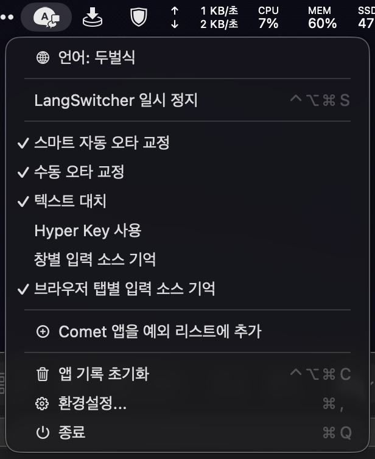
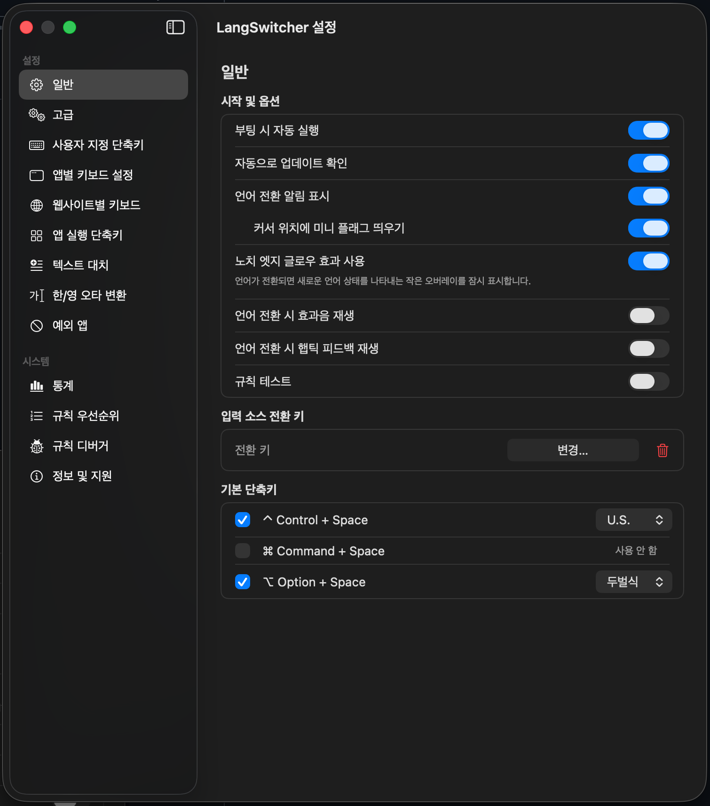

# <p align="center">🌐 LangSwitcher v0.8.0</p>

<p align="center">
  
</p>

<p align="center">
  <strong>A lightweight macOS menu bar app for faster, smarter, and more predictable input source switching.</strong>
</p>

<p align="center">
  macOS에서 입력 언어 전환을 더 빠르고 정확하게 만들어 주는 경량 메뉴바 앱입니다.
</p>

---

## English

### What’s New in v0.8.0

#### ⚡ Zero-Delay Typo Correction
The typo-correction engine has been redesigned for high-speed typing. LangSwitcher now switches the macOS input source first and removes artificial backspace timers, making corrections feel instant and preventing broken characters or leftover English text. [file:2]

#### ✍️ Custom Text Expansion / Snippets
v0.8.0 introduces custom text expansion, allowing short triggers to be automatically replaced with predefined text after typing a trigger and pressing Space. The feature also supports dynamic placeholders such as date/time patterns and clipboard insertion, including examples like `{{date:yyyy-MM-dd}}`, `{{date:HH:mm}}`, and `{{clipboard}}`. [file:3]

Examples:
- `;date` → `{{date:yyyy-MM-dd}}` [file:3]
- `;time` → `{{date:HH:mm}}` [file:3]
- `;now` → `{{date:yyyy-MM-dd HH:mm}}` [file:3]
- `;day` → `{{date:EEEE}}` [file:3]
- `;clip` → `{{clipboard}}` [file:3]

#### 🛡️ Smart Shortcut Conflict Prevention
App Launch Shortcuts now block conflicting key combinations such as `Cmd + Space` only when those shortcuts are already being used as active default language toggles. This makes shortcut setup safer without being unnecessarily restrictive. [file:2]

#### 🔒 Stability and Thread-Safety Improvements
This release improves reliability during rapid keyboard input and heavy multitasking. It includes stricter `NSLock` protection against race conditions, optimized SwiftUI trace rendering to reduce CPU spikes, and Hyper Key debounce logic to prevent runaway JXA execution on repeated Caps Lock taps. [file:2]

---

### Why LangSwitcher?

If you often launch apps or jump into search fields with keyboard shortcuts, you’ve probably experienced typing in the wrong language right after focusing a new app or browser tab. LangSwitcher is designed to reduce those interruptions and keep your keyboard workflow smooth. [file:2]

It combines direct language switching, app-specific input rules, browser tab language memory, app launch shortcuts, typo correction, and text expansion in one native macOS menu bar app. [file:2][file:3]

---

### Core Features

- Direct input source switching with custom shortcuts. [file:2]
- App-specific keyboard rules that automatically switch language when an app becomes active. [file:2]
- Browser Tab Memory for Chrome, Safari, Edge, and Brave. [file:2]
- Typo correction for mistyped English ⇄ Korean text. [file:2]
- Custom Text Expansion / Snippets with trigger-based replacement. [file:3]
- Dynamic snippet variables for date, time, weekday, and clipboard content. [file:3]
- Hyper Key mapping for Caps Lock (`⌃⌥⇧⌘`). [file:2]
- Single modifier toggle key support, such as Right Command or Right Option. [file:2]
- App Launch Shortcuts to launch or focus apps instantly. [file:2]
- Native HUD feedback for input source changes and rule test results. [file:2]
- Backup and restore settings with JSON export/import. [file:2]

---

### Screenshots

<p align="center">
  
</p>

<p align="center">
  
</p>

---

### System Requirements

| Item | Requirement |
|---|---|
| OS | macOS 13.5 or later [file:2] |
| Architecture | Apple Silicon only (M1 / M2 / M3 / M4) [file:2] |

---

### Installation

> [!WARNING]
> LangSwitcher is a free open-source project and is not signed with a paid Apple Developer account, so macOS may show an **“unidentified developer”** warning on first launch. [file:2]

1. Go to the **Releases** page.
2. Download the latest `LangSwitcher_v0.8.0.zip`.
3. Extract the ZIP file.
4. Move `LangSwitcher.app` to `/Applications`.
5. Right-click the app and choose **Open**. [file:2]

#### If macOS says the app is damaged

Run the following command in Terminal: [file:2]

```bash
sudo xattr -r -d com.apple.quarantine /Applications/LangSwitcher.app
```

---

### Permissions

#### 1. Accessibility Permission (Required)

Required for: [file:2]

- Global shortcut detection. [file:2]
- Typo correction. [file:2]
- Input source control. [file:2]

Enable here: [file:2]

```text
System Settings
→ Privacy & Security
→ Accessibility
→ Enable LangSwitcher
```

#### 2. Automation Permission (Optional)

Required for Browser Tab Memory. [file:2]

Supported browsers include Chrome, Safari, Edge, and Brave. [file:2]

Enable here: [file:2]

```text
System Settings
→ Privacy & Security
→ Automation
→ Enable supported browsers under LangSwitcher
```

---

### Update Notes

If shortcuts stop working after updating, remove LangSwitcher from Accessibility settings and add it again. This can resolve permission cache issues after an app update. [file:2]

```text
Accessibility
→ Remove (-)
→ Add (+)
```

---

### Quick Start

1. Launch LangSwitcher from the menu bar. [file:2]
2. Open **Preferences**. [file:2]
3. Configure startup behavior, HUD, Hyper Key, toggle key, and text expansion rules. [file:2][file:3]
4. Enable Window Focus Management and Browser Tab Memory. [file:2]
5. Add custom language shortcuts. [file:2]
6. Set app-specific keyboard rules. [file:2]
7. Add app launch shortcuts and text snippets. [file:2][file:3]

---

### Donations

If LangSwitcher helps improve your workflow, consider supporting the project. Your support helps maintain and improve the app. [file:2]

| Cryptocurrency | Wallet Address |
|---|---|
| Bitcoin (BTC) | `14eZvFmfSnste92o66DcFq9ns7JqWepu1s` [file:2] |
| Dogecoin (DOGE) | `D9sGuU6wXVCSnAPTESQsy1QcsxmTHt6VDW` [file:2] |

---

### Contributing

Contributions are always welcome. You can help with bug reports, feature requests, pull requests, translations, and documentation improvements. [file:2]

---

### License

This project is licensed under the **GNU General Public License v3.0 (GPL-3.0)**. See the `LICENSE` file for details. [file:2]

---

# 🇰🇷 한국어

<details>
<summary><strong>클릭해서 한국어 버전 보기</strong></summary>

### v0.8.0 업데이트

#### ⚡ 무지연(Zero-Delay) 초고속 오타 교정
초고속 타이핑 환경에 맞춰 오타 교정 엔진의 실행 순서를 전면 재설계했습니다. macOS 입력 소스 전환을 먼저 실행하고 인위적인 백스페이스 타이머를 제거해, 글자가 꼬이거나 영문 찌꺼기가 남는 문제 없이 즉각적인 교정을 제공합니다. [file:2]

#### ✍️ 커스텀 텍스트 대치 (Text Expansion / Snippets)
v0.8.0에서는 사용자가 직접 텍스트 대치 규칙을 등록할 수 있는 기능이 추가되었습니다. 짧은 트리거를 입력한 뒤 스페이스를 누르면 미리 지정한 텍스트로 자동 치환되며, 날짜/시간 포맷과 클립보드 같은 동적 변수도 지원합니다. [file:3]

예시:
- `;date` → `{{date:yyyy-MM-dd}}` [file:3]
- `;time` → `{{date:HH:mm}}` [file:3]
- `;now` → `{{date:yyyy-MM-dd HH:mm}}` [file:3]
- `;day` → `{{date:EEEE}}` [file:3]
- `;clip` → `{{clipboard}}` [file:3]

#### 🛡️ 스마트 단축키 충돌 방지
앱 실행 단축키 등록 시 `Cmd + Space` 같은 조합이 현재 기본 언어 전환 단축키로 실제 사용 중일 때만 충돌로 판단해 차단합니다. 불필요한 제한 없이 더 안전하게 단축키를 설정할 수 있습니다. [file:2]

#### 🔒 안정성 및 스레드 안전성 향상
빠른 타이핑과 멀티태스킹 상황에서의 안정성을 높였습니다. `NSLock` 기반 경쟁 상태 방지, SwiftUI 추적 로그 렌더링 최적화에 따른 CPU 스파이크 감소, Caps Lock 연타 시 JXA 중복 실행 방지용 Hyper Key 디바운스 로직이 포함됩니다. [file:2]

---

### LangSwitcher 소개

LangSwitcher는 단축키 중심 워크플로우에서 발생하는 입력 소스 전환 스트레스를 줄여 주는 macOS 메뉴바 앱입니다. Spotlight, ChatGPT, Terminal, 브라우저, 메신저처럼 포커스가 자주 바뀌는 환경에서 특히 유용합니다. [file:2]

직접 입력 언어 전환, 앱별 자동 입력 언어 규칙, 브라우저 탭별 언어 기억, 앱 실행 단축키, 오타 자동 변환, 텍스트 대치 기능을 하나의 네이티브 앱으로 제공합니다. [file:2][file:3]

---

### 핵심 기능

- 사용자 지정 단축키로 입력 소스를 직접 전환. [file:2]
- 특정 앱 활성화 시 자동으로 언어를 바꾸는 앱별 키보드 규칙. [file:2]
- Chrome, Safari, Edge, Brave용 브라우저 탭별 언어 기억. [file:2]
- 영문 ⇄ 한글 오타 자동 변환. [file:2]
- 트리거 기반 커스텀 텍스트 대치 / 스니펫 기능. [file:3]
- 날짜, 시간, 요일, 클립보드 내용을 넣을 수 있는 동적 변수 지원. [file:3]
- Caps Lock을 Hyper Key(`⌃⌥⇧⌘`)로 매핑. [file:2]
- Right Command, Right Option 같은 단일 수식 키 전환 지원. [file:2]
- 앱을 즉시 실행하거나 앞으로 가져오는 앱 실행 단축키. [file:2]
- 입력 언어 변경과 규칙 테스트 결과를 보여 주는 네이티브 HUD. [file:2]
- JSON 기반 설정 백업 및 복원. [file:2]

---

### 스크린샷

<p align="center">
  
</p>

<p align="center">
  
</p>

---

### 시스템 요구사항

| 항목 | 요구사항 |
|---|---|
| 운영체제 | macOS 13.5 이상 [file:2] |
| 아키텍처 | Apple Silicon 전용 (M1 / M2 / M3 / M4) [file:2] |

---

### 설치 방법

> [!WARNING]
> LangSwitcher는 무료 오픈소스 프로젝트이며 유료 Apple Developer 계정으로 서명되지 않았기 때문에 최초 실행 시 macOS에서 **확인되지 않은 개발자** 경고가 표시될 수 있습니다. [file:2]

1. **Releases** 페이지로 이동합니다.
2. 최신 `LangSwitcher_v0.8.0.zip` 파일을 다운로드합니다.
3. ZIP 압축을 해제합니다.
4. `LangSwitcher.app`을 `/Applications` 폴더로 이동합니다.
5. 앱을 우클릭한 뒤 **열기(Open)** 를 선택합니다. [file:2]

#### macOS에서 앱이 손상되었다고 표시될 때

아래 명령을 Terminal에서 실행하세요. [file:2]

```bash
sudo xattr -r -d com.apple.quarantine /Applications/LangSwitcher.app
```

---

### 권한 설정

#### 1. 손쉬운 사용 권한 (필수)

필요 기능: [file:2]

- 글로벌 단축키 감지. [file:2]
- 오타 자동 변환. [file:2]
- 입력 소스 제어. [file:2]

설정 위치: [file:2]

```text
시스템 설정
→ 개인정보 보호 및 보안
→ 손쉬운 사용
→ LangSwitcher 활성화
```

#### 2. 자동화 권한 (선택)

브라우저 탭별 언어 기억 기능에 필요합니다. [file:2]

지원 브라우저는 Chrome, Safari, Edge, Brave입니다. [file:2]

설정 위치: [file:2]

```text
시스템 설정
→ 개인정보 보호 및 보안
→ 자동화
→ LangSwitcher 하위 브라우저 활성화
```

---

### 업데이트 후 단축키가 동작하지 않을 때

업데이트 후 단축키가 동작하지 않으면 손쉬운 사용 목록에서 LangSwitcher를 제거한 뒤 다시 추가하세요. 앱 업데이트 후 발생하는 권한 캐시 문제 해결에 도움이 됩니다. [file:2]

```text
손쉬운 사용
→ 제거 (-)
→ 추가 (+)
```

---

### 빠른 시작

1. 메뉴바에서 LangSwitcher를 실행합니다. [file:2]
2. **환경설정(Preferences)** 를 엽니다. [file:2]
3. 자동 실행, HUD, Hyper Key, 입력 전환 키, 텍스트 대치 규칙을 설정합니다. [file:2][file:3]
4. 창 포커스 관리와 브라우저 탭 기억 기능을 활성화합니다. [file:2]
5. 사용자 지정 언어 단축키를 등록합니다. [file:2]
6. 앱별 키보드 규칙을 설정합니다. [file:2]
7. 앱 실행 단축키와 텍스트 스니펫을 추가합니다. [file:2][file:3]

---

### Donations / 후원

LangSwitcher가 작업 흐름 개선에 도움이 되었다면 프로젝트 후원을 고려해 주세요. 후원은 프로젝트 유지 및 기능 개선에 큰 도움이 됩니다. [file:2]

| 암호화폐 | 지갑 주소 |
|---|---|
| 비트코인 (BTC) | `14eZvFmfSnste92o66DcFq9ns7JqWepu1s` [file:2] |
| 도지코인 (DOGE) | `D9sGuU6wXVCSnAPTESQsy1QcsxmTHt6VDW` [file:2] |

---

### 기여

버그 제보, 기능 제안, Pull Request, 번역, 문서 개선 등 다양한 기여를 언제든 환영합니다. [file:2]

---

### 라이선스

이 프로젝트는 **GNU General Public License v3.0 (GPL-3.0)** 라이선스를 따릅니다. 자세한 내용은 `LICENSE` 파일을 참고하세요. [file:2]