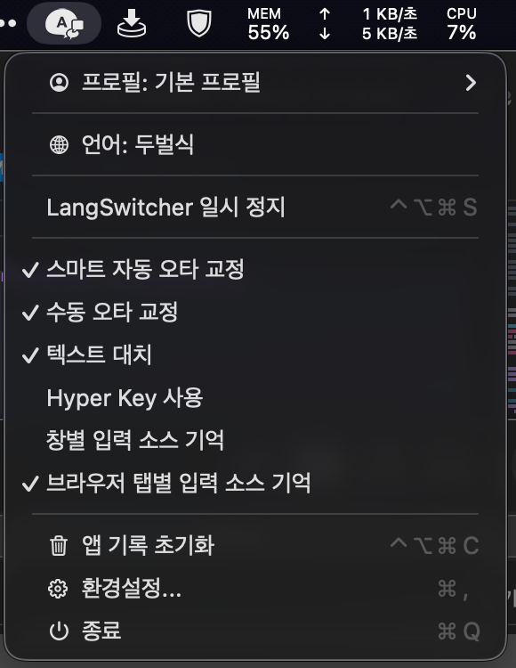
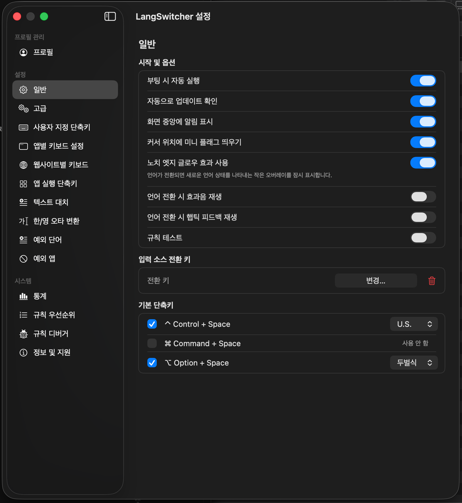

<p align="center">
  
</p>

<h1 align="center">🌐 LangSwitcher</h1>

<p align="center">
  <strong>A lightweight macOS menu bar app for faster, smarter, and more predictable input source switching.</strong>
  <br>
  macOS에서 입력 언어 전환을 더 빠르고 정확하게 만들어 주는 경량 메뉴바 앱입니다.
</p>

<p align="center">
  <a href="https://github.com/sponsors/peepworks">
    
  </a>
</p>

<p align="center">
  <a href="#english">English</a>
  ·
  <a href="#한국어">한국어</a>
</p>

---

# English

## Overview

LangSwitcher is a native macOS menu bar app designed to make input source switching faster, smarter, and more reliable.

It helps reduce the interruptions caused by typing in the wrong language while moving between apps, browser tabs, Spotlight, Terminal, messengers, code editors, and other keyboard-focused workflows.

LangSwitcher brings input source shortcuts, app-specific language rules, browser tab memory, English ↔ Korean typo correction, text expansion, app launch shortcuts, and profile-based settings into one lightweight macOS app.

## Core Features

### Input Source Control

- Switch input sources with custom global shortcuts
- Use a single modifier key as a language toggle, including Right Command or Right Option
- Map Caps Lock to Hyper Key (`⌃⌥⇧⌘`)
- Display native HUD feedback when the input source changes
- Use profile-based configurations for different workflows

### App and Window Awareness

- Automatically switch input sources when a specific app becomes active
- Configure app-specific keyboard rules
- Track active windows and focus changes
- Support browser tab input-source memory
- Support Google Chrome, Safari, Microsoft Edge, and Brave
- Improve focus tracking for Chromium-based Web Apps (PWAs)

### Korean and English Typo Correction

- Convert mistyped English ↔ Korean text
- Detect real-time Unicode input to reduce false corrections during mixed Korean, number, and symbol typing
- Handle strings such as `2026-10-19일` more safely
- Use paced asynchronous deletion to improve correction reliability in Chrome, Notion, TextEdit, and similar apps

### Text Expansion and Snippets

- Expand short triggers into text, templates, email replies, code snippets, and clipboard content
- Use an AppKit-based visual inline Token Editor
- Click or double-click tokens to edit their properties
- Right-click tokens to duplicate or delete them
- Store snippet metadata in readable plain-text form
- Use dynamic variables for date, time, clipboard, selected text, and cursor placement
- Create interactive forms that collect values before expansion
- Synchronize repeated input fields by using the same field name
- Use hybrid insertion methods for reliable long-text and IDE insertion
- Preserve precise character-level input for cursor-navigation macros

### Automation and Productivity

- Launch or focus applications with keyboard shortcuts
- Use Window Focus Management for app-aware workflows
- Save and restore settings through JSON backup and import
- Monitor and recover memory usage during long-running sessions
- Maintain reliable monitoring during window dragging, menu navigation, and modal interactions

---

## Text Expansion Guide

LangSwitcher lets you turn short abbreviations (**Triggers**) into email templates, boilerplate text, code snippets, clipboard content, and interactive input forms.

### Basic Text Expansion

| Item | Description |
|---|---|
| **Trigger** | A short abbreviation you type, such as `;em`. Using a prefix like `;` helps prevent accidental expansion. |
| **Replacement Text** | The text inserted when the trigger is expanded, such as `my.email@gmail.com`. |

Example:

```text
Trigger: ;em
Replacement: my.email@gmail.com
```

### Dynamic Variables

Use the **[⊕ Insert Element]** interface to insert dynamic values into a template.

| Variable | Description | Example Output |
|---|---|---|
| `{{date:yyyy-MM-dd}}` | Current date | `2026-07-12` |
| `{{time:HH:mm}}` | Current time | `14:30` |
| `{{clipboard}}` | Most recently copied text | Clipboard content |
| `${selectedText}` | Currently selected text | Selected content |
| `{{cursor}}` | Final cursor location after expansion | Cursor position |

### Interactive Form Fields

LangSwitcher can detect form fields in a template and ask for missing values immediately before expansion.

| Element | Description |
|---|---|
| `input` | Single-line text field |
| `textarea` | Multi-line text area |
| `select` | Dropdown menu |
| `checkbox` | Checkbox toggle |
| `radio` | Radio-button selection |
| `datepicker` | Date picker |
| `optional` | Optional content block |

### Field Synchronization

Use the exact same field name in multiple tokens to synchronize values automatically.

For example, every occurrence of `{{input:CustomerName}}` shares the same entered value. This is useful when a customer name, project name, ID, date, or other value must appear several times in a document.

### Interactive Template Example

```text
Hello {{input:CustomerName}},

Thank you for selecting our platform. Your account ID is
{{input:AccountID|1000&size=120&required=true}}.

We will review your inquiry by
{{datepicker:Deadline|yyyy-MM-dd}}.

Best regards,
{{cursor}}
```

When this snippet runs, LangSwitcher requests values for any incomplete fields and then inserts the completed text.

### Text Insertion Behavior

LangSwitcher selects an insertion method based on snippet length, target application, and cursor-navigation requirements.

| Situation | Insertion Method |
|---|---|
| Short standard snippets | Simulated keyboard input |
| Long snippets, generally 200 characters or more | High-speed clipboard insertion |
| IDE or code-editor targets | Clipboard insertion with paced paste handling |
| Macros using cursor navigation or `tabStops` | Character-by-character atomic Unicode input |

This approach improves reliability for long text while preserving accurate cursor movement in form and code templates.

---

## Screenshots

<p align="center">
  
</p>

<p align="center">
  
</p>

---

## System Requirements

| Item | Requirement |
|---|---|
| Operating System | macOS 13.5 or later |
| Architecture | Apple Silicon only: M1, M2, M3, or M4 |

---

## Installation

> [!WARNING]
> LangSwitcher is a free open-source project and is not signed with a paid Apple Developer account. macOS may show an “unidentified developer” warning on first launch.

1. Go to the [Releases](../../releases) page.
2. Download the latest `LangSwitcher` ZIP file.
3. Extract the ZIP file.
4. Move `LangSwitcher.app` to `/Applications`.
5. Right-click the app and select **Open**.

### If macOS Says the App Is Damaged

Run the following command in Terminal:

```bash
sudo xattr -r -d com.apple.quarantine /Applications/LangSwitcher.app
```

---

## Permissions

### Accessibility Permission — Required

Accessibility permission is required for:

- Global shortcut detection
- Input source control
- English ↔ Korean typo correction
- Text expansion and automated keyboard input
- App and window focus tracking

Enable it here:

```text
System Settings
→ Privacy & Security
→ Accessibility
→ Enable LangSwitcher
```

### Automation Permission — Optional

Automation permission is required for Browser Tab Memory and browser-related automation.

Supported browsers:

- Google Chrome
- Safari
- Microsoft Edge
- Brave

Enable it here:

```text
System Settings
→ Privacy & Security
→ Automation
→ Enable supported browsers under LangSwitcher
```

---

## Troubleshooting

### Shortcuts Do Not Work After an Update

If shortcuts stop working after updating LangSwitcher, remove the app from Accessibility permissions and add it again.

```text
System Settings
→ Privacy & Security
→ Accessibility
→ Select LangSwitcher
→ Remove (−)
→ Add (+) LangSwitcher again
```

This can resolve macOS permission-cache issues.

### Browser Tab Memory Does Not Work

Check that:

1. Browser Tab Memory is enabled in LangSwitcher preferences.
2. Automation permission is enabled for the browser.
3. LangSwitcher is enabled under **System Settings → Privacy & Security → Automation**.

### Text Expansion Does Not Work

Check that:

1. Accessibility permission is enabled.
2. The trigger is configured correctly.
3. The target app allows simulated keyboard input.
4. The selected profile contains the relevant text expansion rule.

---

## Quick Start

1. Launch LangSwitcher from the menu bar.
2. Open **Preferences**.
3. Configure startup behavior, HUD, Hyper Key, toggle key, and profiles.
4. Enable Window Focus Management and Browser Tab Memory if needed.
5. Add custom input-source shortcuts.
6. Configure app-specific keyboard rules.
7. Add app launch shortcuts.
8. Create text expansion snippets and interactive templates.
9. Export a JSON backup after completing your configuration.

---

## Support LangSwitcher

LangSwitcher is a free open-source project maintained by a solo developer. If it improves your workflow, please consider supporting continued development.

### GitHub Sponsors

[👉 Sponsor on GitHub](https://github.com/sponsors/peepworks)

### Cryptocurrency Donations

| Cryptocurrency | Wallet Address |
|---|---|
| Bitcoin (BTC) | `14eZvFmfSnste92o66DcFq9ns7JqWepu1s` |
| Dogecoin (DOGE) | `D9sGuU6wXVCSnAPTESQsy1QcsxmTHt6VDW` |

---

## Contributing

Contributions are welcome.

You can help by submitting:

- Bug reports
- Feature requests
- Pull requests
- Translations
- Documentation improvements

---

## License

This project is licensed under the [GNU General Public License v3.0](LICENSE) (`GPL-3.0`).

---

# 한국어

<details>
<summary><strong>클릭해서 한국어 버전 보기</strong></summary>

<br>

## 소개

LangSwitcher는 macOS에서 입력 언어 전환을 더 빠르고 정확하며 예측 가능하게 만들어 주는 네이티브 메뉴바 앱입니다.

앱, 브라우저 탭, Spotlight, Terminal, 메신저, 코드 에디터처럼 포커스가 자주 바뀌는 작업 환경에서 잘못된 입력 언어로 타이핑하는 불편을 줄여 줍니다.

입력 소스 단축키, 앱별 언어 규칙, 브라우저 탭 언어 기억, 영문 ↔ 한글 오타 변환, 텍스트 대치, 앱 실행 단축키, 프로필 기반 설정 관리를 하나의 가벼운 macOS 앱에서 제공합니다.

## 핵심 기능

### 입력 소스 제어

- 사용자 지정 글로벌 단축키로 입력 소스 전환
- Right Command, Right Option 같은 단일 수식 키를 언어 전환 키로 사용
- Caps Lock을 Hyper Key(`⌃⌥⇧⌘`)로 매핑
- 입력 언어 변경 시 네이티브 HUD 표시
- 작업 환경에 따라 설정을 분리할 수 있는 프로필 기능

### 앱 및 창 인식

- 특정 앱이 활성화되면 입력 언어를 자동으로 전환
- 앱별 키보드 및 입력 소스 규칙 설정
- 활성 창과 포커스 변경 감지
- 브라우저 탭별 입력 언어 기억
- Google Chrome, Safari, Microsoft Edge, Brave 지원
- Chrome·Edge 기반 웹앱(PWA)의 포커스 감지 개선

### 한영 오타 변환

- 영문 ↔ 한글 오타 자동 변환
- 한글, 숫자, 기호가 섞인 입력에서 잘못된 오타 교정을 줄이는 실시간 유니코드 감지
- `2026-10-19일`과 같은 혼합 문자열을 더 안전하게 처리
- Chrome, Notion, TextEdit 등에서 안정적인 자동 삭제를 위한 비동기 백스페이스 페이싱

### 텍스트 대치 및 스니펫

- 짧은 트리거를 이메일 양식, 상용구, 코드 조각, 클립보드 내용, 템플릿으로 확장
- AppKit 기반 비주얼 인라인 토큰 에디터
- 토큰 클릭 또는 더블 클릭으로 속성 편집
- 토큰 우클릭으로 복제 및 삭제
- 읽기 쉬운 일반 텍스트 기반 스니펫 메타데이터
- 날짜, 시간, 클립보드, 선택 텍스트, 커서 위치를 위한 동적 변수
- 실행 전에 값을 받는 대화형 폼 템플릿
- 동일 필드명을 이용한 입력값 자동 동기화
- 장문 및 IDE 환경에 적합한 하이브리드 텍스트 입력
- 커서 이동 매크로를 위한 문자 단위 정밀 입력

### 자동화 및 생산성

- 단축키로 앱을 즉시 실행하거나 앞으로 가져오기
- 앱 중심 작업 흐름을 위한 창 포커스 관리
- JSON 기반 설정 백업 및 복원
- 장시간 실행 중 메모리 상태 모니터링 및 복구
- 창 드래그, 메뉴 탐색, 모달 화면 중에도 유지되는 모니터링

---

## 텍스트 대치 가이드

LangSwitcher의 텍스트 대치 기능을 사용하면 짧은 약어(**트리거**)만으로 이메일 양식, 상용구, 코드 조각, 클립보드 내용, 대화형 입력 템플릿을 빠르게 작성할 수 있습니다.

### 기본 텍스트 대치

| 항목 | 설명 |
|---|---|
| **트리거(Trigger)** | 사용자가 입력할 짧은 약어입니다. 예: `;em` |
| **변환 텍스트(Replacement Text)** | 트리거가 실행될 때 삽입할 최종 텍스트입니다. 예: `my.email@gmail.com` |

일반 입력 중 실수로 실행되는 것을 방지하기 위해 `;` 같은 접두사를 사용하는 것을 권장합니다.

```text
트리거: ;em
변환 텍스트: my.email@gmail.com
```

### 동적 변수

템플릿 작성 화면의 **[⊕ 요소 삽입]** 기능을 통해 현재 시스템 데이터를 삽입할 수 있습니다.

| 변수 | 설명 | 출력 예시 |
|---|---|---|
| `{{date:yyyy-MM-dd}}` | 현재 날짜 | `2026-07-12` |
| `{{time:HH:mm}}` | 현재 시간 | `14:30` |
| `{{clipboard}}` | 마지막으로 복사한 텍스트 | 클립보드 내용 |
| `${selectedText}` | 현재 선택된 텍스트 | 선택 영역 내용 |
| `{{cursor}}` | 대치 완료 후 최종 커서 위치 | 커서 위치 |

### 대화형 폼 요소

템플릿 내부의 입력 요소를 감지하여 스니펫 실행 직전에 필요한 값을 입력받을 수 있습니다.

| 요소 | 설명 |
|---|---|
| `input` | 한 줄 텍스트 입력 |
| `textarea` | 여러 줄 텍스트 입력 |
| `select` | 드롭다운 메뉴 |
| `checkbox` | 체크박스 토글 |
| `radio` | 라디오 버튼 선택 |
| `datepicker` | 날짜 선택기 |
| `optional` | 선택형 내용 블록 |

### 동일 필드명 동기화

템플릿 내부의 여러 토큰에 정확히 같은 필드명을 사용하면 값이 자동으로 동기화됩니다.

예를 들어 `{{input:고객명}}`을 여러 위치에 사용하면 한 번 입력한 고객명 값이 템플릿 전체에 동일하게 적용됩니다. 고객명, 프로젝트명, ID, 날짜처럼 반복되는 내용을 입력할 때 유용합니다.

### 대화형 템플릿 예시

```text
안녕하세요 {{input:고객명}}님,

저희 서비스를 이용해 주셔서 감사합니다.
회원님의 고유 식별 코드는
{{input:고객ID|1000&size=120&required=true}} 입니다.

요청하신 사안은
{{datepicker:마감일|yyyy-MM-dd}}까지 검토를 완료하겠습니다.

감사합니다.
{{cursor}}
```

스니펫을 실행하면 LangSwitcher가 비어 있는 입력 항목을 찾아 값을 요청한 뒤, 완성된 텍스트를 삽입합니다.

### 텍스트 삽입 방식

LangSwitcher는 텍스트 길이, 대상 앱, 커서 이동 필요 여부에 따라 적절한 입력 방식을 자동으로 선택합니다.

| 상황 | 적용 방식 |
|---|---|
| 일반적인 짧은 스니펫 | 시뮬레이션 키보드 입력 |
| 200자 이상의 긴 스니펫 | 고속 클립보드 붙여넣기 |
| IDE 또는 코드 편집기 | 페이싱 기반 클립보드 붙여넣기 |
| 커서 이동 또는 `tabStops`를 사용하는 매크로 | 문자 단위 아토믹 유니코드 입력 |

긴 문장은 안정적인 클립보드 방식으로 입력하고, 코드 스니펫이나 폼 자동화처럼 정확한 커서 위치 제어가 필요한 매크로는 문자 단위 입력을 유지합니다.

---

## 스크린샷

<p align="center">
  
</p>

<p align="center">
  
</p>

---

## 시스템 요구사항

| 항목 | 요구사항 |
|---|---|
| 운영체제 | macOS 13.5 이상 |
| 아키텍처 | Apple Silicon 전용: M1, M2, M3, M4 |

---

## 설치 방법

> [!WARNING]
> LangSwitcher는 무료 오픈소스 프로젝트이며 유료 Apple Developer 계정으로 서명되지 않았습니다. 최초 실행 시 macOS에서 “확인되지 않은 개발자” 경고가 표시될 수 있습니다.

1. [Releases](../../releases) 페이지로 이동합니다.
2. 최신 LangSwitcher ZIP 파일을 다운로드합니다.
3. ZIP 압축을 해제합니다.
4. `LangSwitcher.app`을 `/Applications` 폴더로 이동합니다.
5. 앱을 우클릭한 뒤 **열기(Open)** 를 선택합니다.

### macOS에서 앱이 손상되었다고 표시될 때

Terminal에서 아래 명령을 실행하세요.

```bash
sudo xattr -r -d com.apple.quarantine /Applications/LangSwitcher.app
```

---

## 권한 설정

### 손쉬운 사용 권한 — 필수

다음 기능을 사용하려면 손쉬운 사용 권한이 필요합니다.

- 글로벌 단축키 감지
- 입력 소스 제어
- 영문 ↔ 한글 오타 변환
- 텍스트 대치 및 자동 키보드 입력
- 앱 및 창 포커스 감지

설정 위치:

```text
시스템 설정
→ 개인정보 보호 및 보안
→ 손쉬운 사용
→ LangSwitcher 활성화
```

### 자동화 권한 — 선택

브라우저 탭별 언어 기억 및 브라우저 자동화 기능을 사용하려면 자동화 권한이 필요합니다.

지원 브라우저:

- Google Chrome
- Safari
- Microsoft Edge
- Brave

설정 위치:

```text
시스템 설정
→ 개인정보 보호 및 보안
→ 자동화
→ LangSwitcher 하위 브라우저 활성화
```

---

## 문제 해결

### 업데이트 후 단축키가 동작하지 않을 때

앱 업데이트 후 단축키가 동작하지 않으면 손쉬운 사용 권한에서 LangSwitcher를 제거한 뒤 다시 추가하세요.

```text
시스템 설정
→ 개인정보 보호 및 보안
→ 손쉬운 사용
→ LangSwitcher 선택
→ 제거 (−)
→ 추가 (+) 후 LangSwitcher 다시 등록
```

macOS 권한 캐시 문제를 해결하는 데 도움이 됩니다.

### 브라우저 탭 기억이 동작하지 않을 때

다음 항목을 확인하세요.

1. LangSwitcher 환경설정에서 브라우저 탭 기억 기능이 활성화되어 있는지 확인합니다.
2. 대상 브라우저의 자동화 권한이 활성화되어 있는지 확인합니다.
3. **시스템 설정 → 개인정보 보호 및 보안 → 자동화**에서 LangSwitcher의 브라우저 제어가 허용되어 있는지 확인합니다.

### 텍스트 대치가 동작하지 않을 때

다음 항목을 확인하세요.

1. 손쉬운 사용 권한이 활성화되어 있는지 확인합니다.
2. 트리거가 올바르게 설정되어 있는지 확인합니다.
3. 대상 앱이 시뮬레이션 키보드 입력을 허용하는지 확인합니다.
4. 현재 선택된 프로필에 해당 텍스트 대치 규칙이 포함되어 있는지 확인합니다.

---

## 빠른 시작

1. 메뉴바에서 LangSwitcher를 실행합니다.
2. **환경설정(Preferences)** 을 엽니다.
3. 자동 실행, HUD, Hyper Key, 입력 전환 키, 프로필을 설정합니다.
4. 필요한 경우 창 포커스 관리와 브라우저 탭 기억 기능을 활성화합니다.
5. 사용자 지정 입력 소스 단축키를 등록합니다.
6. 앱별 키보드 및 입력 언어 규칙을 설정합니다.
7. 앱 실행 단축키를 등록합니다.
8. 텍스트 대치 스니펫과 대화형 템플릿을 작성합니다.
9. 설정이 완료되면 JSON 백업 파일을 내보냅니다.

---

## LangSwitcher 후원하기

LangSwitcher는 1인 개발자가 유지하는 무료 오픈소스 프로젝트입니다. 작업 흐름 개선에 도움이 되었다면 지속적인 개발을 후원해 주세요.

### GitHub Sponsors

[👉 GitHub Sponsors로 후원하기](https://github.com/sponsors/peepworks)

### 암호화폐 후원

| 암호화폐 | 지갑 주소 |
|---|---|
| 비트코인 (BTC) | `14eZvFmfSnste92o66DcFq9ns7JqWepu1s` |
| 도지코인 (DOGE) | `D9sGuU6wXVCSnAPTESQsy1QcsxmTHt6VDW` |

---

## 기여

버그 제보, 기능 제안, Pull Request, 번역, 문서 개선 등 다양한 기여를 환영합니다.

---

## 라이선스

이 프로젝트는 [GNU General Public License v3.0](LICENSE) (`GPL-3.0`) 라이선스를 따릅니다.